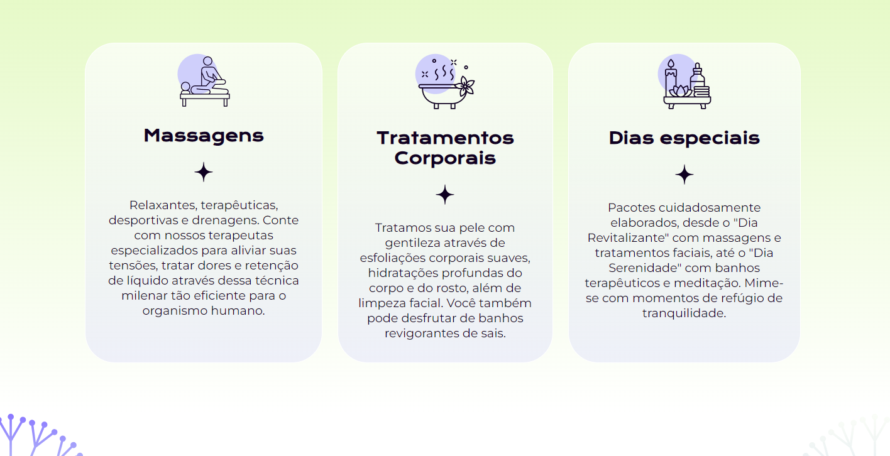

# Alura - Calmaria Spa
 
This is a solution to the [Sass e CSS: estilizando um site](https://cursos.alura.com.br/course/sass-css-estilizando-site). Alura Front-end school help you improve your coding skills by building realistic projects. 

## Table of contents

- [Overview](#overview)
  - [The challenge](#the-challenge)
  - [Screenshot](#screenshot)
  - [Links](#links)
- [My process](#my-process)
  - [Built with](#built-with)
  - [What I learned](#what-i-learned)
  - [Continued development](#continued-development)
  - [Useful resources](#useful-resources)
- [Author](#author)

## Overview

This is the final project for Alura Calmaria Spa using Sass language.

### The challenge

Users should be able to:

As a Freelancer, we should be able to make a full website page for Calmaria Spa using hyper processor Sass.

### Screenshot

### Links

- Solution URL: [GitHub](https://github.com/ViniCellist/Alura-Calmaria-Spa)

## My process

Used Sass to stylish each component of HTML structure.

### Built with

- Semantic HTML5 markup
- Sass

### What I learned

First time using Sass as a stylish language.

### Continued development

I know for sure that this projects opened my mind to see webpage creation in a whole new perspective

### Useful resources

- [HTML 5](https://developer.mozilla.org/en-US/docs/Web) - HTML documentation.
- [Sass](https://sass-lang.com/documentation/) - Sass documentation.

## Author

- GitHub - [Projects](https://github.com/ViniCellist)
- Frontend Mentor - [Profile](https://www.frontendmentor.io/profile/ViniCellist)
- LinkedIn - [Professional](https://www.linkedin.com/in/viniciussouzaduarte/)
- Instagram - [Personal](https://www.instagram.com/vinicius_duartesd/)
